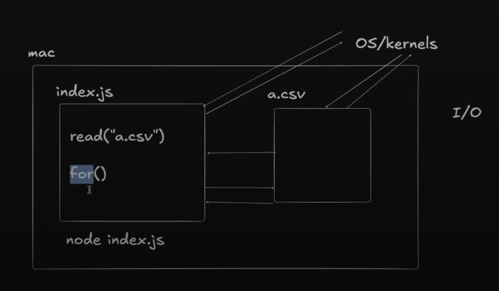
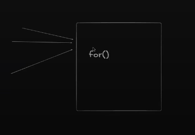

# Lecture 3: Promises, Callbacks, CPU vs IO Tasks

**Date:** 2026-10-04
**Video:** [Promises, Callbacks, CPU vs IO Tasks](https://100xdevs.com/new-courses/21/video/4199?from=%2Fnew-courses%2F21%2Fcontent%3FparentId%3D4154)

## What problem does this solve?

(1-2 lines)

## Key concepts

- JS - async, sync, concurrent, parrallelism (not in JS, rust yes)

- RunJS - https://runjs.app/play

- DSA - never touch async code, but while backend we do

- in dsa - cpu heavy operations for loop while loop if else, in backend - read write other files - input/output heavy operations

- OS/kernel checks wether the node js has permission to read the other file then proceeds
- for loop while loop part of standard javascript syntax, while "fs" exports readFileSync (a separate module) so i need to import it

- require("fs") fs is a internal package/module

- node index.js to run

- meanwhile os is busy reading, js thread runs the other code - this is async programming

- JavaScript parses and initially compiles the code. Synchronous code executes sequentially, while asynchronous code is scheduled and handled by the event loop.

| Async                                   | Parallel                                          |
| --------------------------------------- | ------------------------------------------------- |
| **When** you execute/wait               | **How many things** execute simultaneously        |
| "I don't need to wait."                 | "Let's do both at the same time."                 |
| Can happen with a single thread         | Usually involves multiple threads/cores           |
| JavaScript event loop uses this heavily | JavaScript can use workers for actual parallelism |

- a correct word would be im running these things concurrently

- Start all 3 tasks together, and wait for them to finish. The first one that finishes gets catered to first.

- in disk I/O task though cpu is involved but not the js thread

- js runtime architecture - first the cpu heavy tasks completes than the async code that is completed with its execution is occupied by js thread, no async callback can interupt the cpu heavy task eg for loop

- setTimeout does not use a busy loop. The timer is managed by the JavaScript runtime (browser/Node.js), while the JavaScript thread is free to execute other work. When the timer expires, its callback is queued for execution by the event loop.
JS thread registers a timer with the runtime → runtime/OS tracks when it expires → callback becomes eligible → event loop eventually runs it on the JS thread.

- setInterval does not create multiple simultaneous executions of the callback. If the JS thread is blocked, the callback waits. Missed intervals don't simply pile up into a guaranteed queue.

- so setInterval only puts the callback to the queue if their isnt one previously given by the same setInterval
A single setInterval won't build an unlimited backlog of its own callbacks while the JS thread is blocked.

- And this is exactly why a long-running synchronous loop doesn't result in hundreds of interval callbacks suddenly executing one after another afterward.

- JS is single-threaded for executing JavaScript. The runtime provides asynchronous capabilities outside the JS execution thread and later brings the resulting callbacks back to the JS thread

## Diagram / Screenshot



## Code I wrote

- [filename](filename)
```
function cb(){
    console.log("yo");
}

setInterval(cb,4000);//or setTimeout

let ans = 0;
for(let i = 0;i<25;i++){
    ans+=i;
}
console.log(ans);
```

## Commands / snippets to reuse

```bash
# command here
```

## Gotchas and mistakes


- what if multiple request to a http server, will it handle one at a time
it depends on what is inside, if the task is CPU heavy then yes one at a time, but generally its a a task related to data like database I/O, redis I/O task which is async so we can handle multiple requests

## Still unclear

- Compilation of Javascript

## Rebuilt from memory?

- [ ] Day 1
- [ ] After 1 week

## Rough


