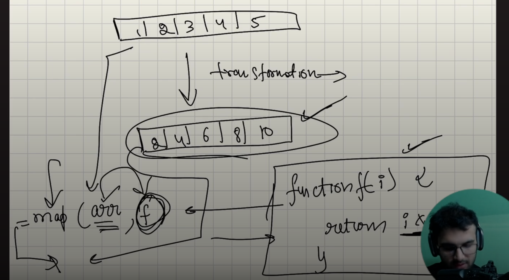
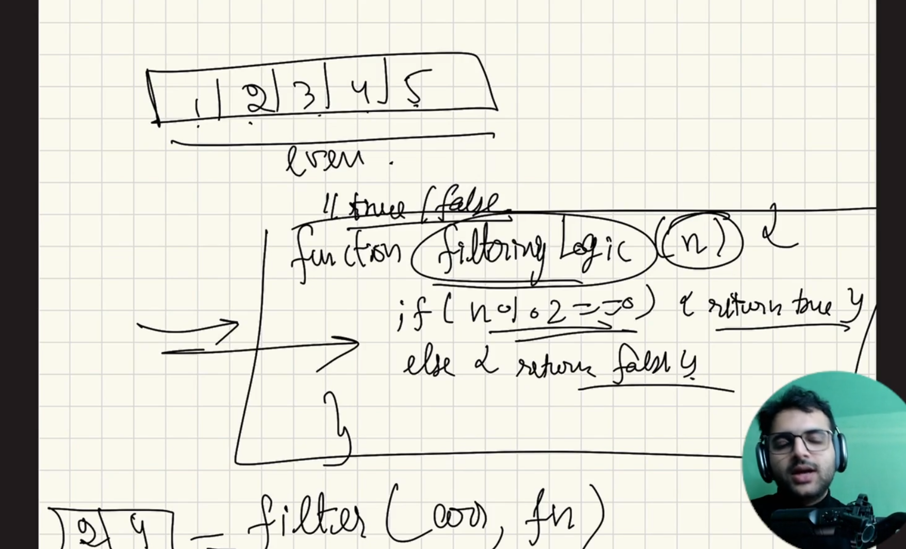

# Lecture 3.1: Map, Filter and Arrow functions

**Date:** 2026-10-07
**Video:** [Map, Filter and Arrow functions](https://100xdevs.com/new-courses/21/video/4205?from=%2Fnew-courses%2F21%2Fcontent%3FparentId%3D4154)

## What problem does this solve?
(1-2 lines)

## Key concepts
- arrow functions and normal functions are structurally different how they are different is the later part (for now just consider it as syntactically different)
- their is no global filter or map function they come with array object
- 

## Diagram / Screenshot
MAP

FILTER


## Code I wrote
- [filename](filename)

## Commands / snippets to reuse
```bash
"Rudra".startsWith(R)
```

## Gotchas and mistakes
- 

## Still unclear
- How is normal function and arrow function are different

## Rebuilt from memory?
- [ ] Day 1
- [ ] After 1 week
