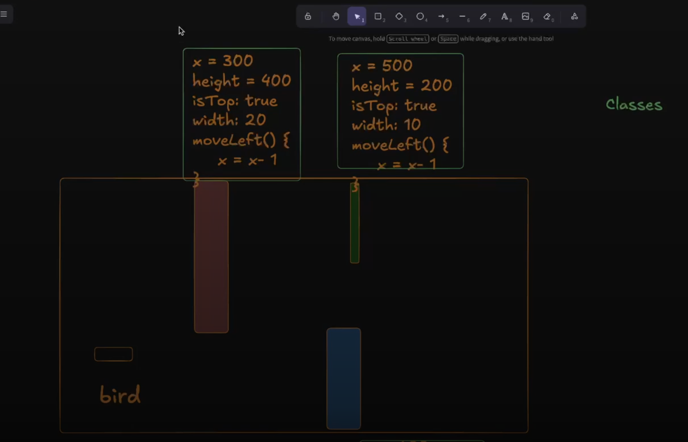
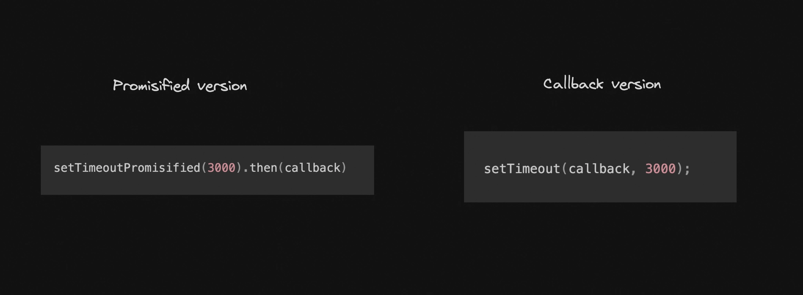
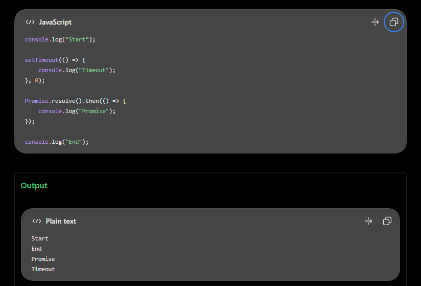
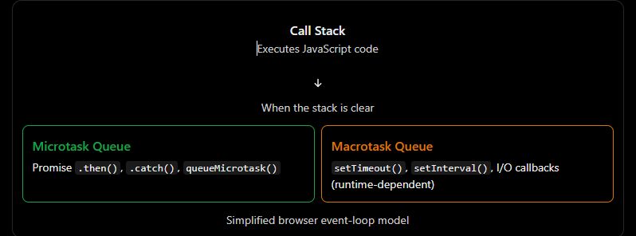

# Lecture X: Title

**Date:** 2026-10-10
**Video:** [Promises](https://100xdevs.com/new-courses/21/video/5854?from=%2Fnew-courses%2F21%2Fcontent%3FparentId%3D4154)
**Notes:** [Notion](https://petal-estimate-4e9.notion.site/Week-4-Async-Deep-Dive-2f47dfd1073581fea951c765a48fc8da)
## What problem does this solve?
(1-2 lines)

## Key concepts
- `this` refers to the object created
- static methods are attached with the class not the associated objects
- while inheritance, one must call the constructor of the parent class too, using the keyword `super()`;
- define the parent class on top
- also child method will override the parent method if they are same;
- you can return or throw `new Error()`
- always use `this` for refering functions inside the class, or else it will identify it as a function outside the class
- **VERY IMPORTANT**: parent has no access to child methods or anything, whereas child has complete access
- The parent class Shape isn't reaching down to find the child's method. Instead, the child instance is running a borrowed method from its parent, and it supplies its own `area()` method when that borrowed code asks for `this.area()`. If you tried to run `new Shape('red', 5).volume()`, it would crash with your custom error message because this would point to the parent, which has no overridden `area()`. (*p.s. volume function inside Shape class; [refered code](1.%20index.js)*)
- Date class and Map class (check harkirat notes), pre defined classes
- Calling a promise is easy, defining your own promise is where things get hard
- no `.then()` means you fired the async call but you didnt call any function in response, similar to firing an empty callback.
- promise has three states: resolve, pending, reject 
- resolve=>`.then()` mein control bhejdo; reject=>`.catch()` mein control bhejdo
- synchronous code first → microtasks next → next macrotask.
- If a macrotask is already executing, a newly created microtask does not interrupt it. JavaScript runs the current callback to completion.

## Diagram / Screenshot
USE OF CLASSES

Promisified syntax, *this function doesn't exists already, for now take it as a blackbox, will define it later*

One rule to remember: synchronous code first → microtasks next → next macrotask.

Preference order: macrotask < microtask


## Code I wrote
- [filename](filename)

## Commands / snippets to reuse
```bash
# command here
```

## Gotchas and mistakes
- make sure you are in the exact folder while running the js code, or else the code will run no doubt but when it accesses the a.txt file it does it in the directory we are in so for that be in the right directory

## Still unclear
- microtasks v/s macrotasks [ChatGPT chat](https://chatgpt.com/c/6aca0c04-2908-83e8-aa15-3f8dad51db61)
- why microtasks first then macro?
- functions return value goes to `.then()` ? *in promise chaining*

**CODE**:
```
console.log("Start");

setTimeout(() => console.log("Timer 1"), 0);

new Promise((resolve) => {
    setTimeout(resolve, 3000);
}).then(() => console.log("Promise"));

setTimeout(() => console.log("Timer 2"), 1000);

console.log("End");
```
**OUTPUT**:
```
Start
End
Timer 1
Timer 2
Promise
```

- Even if Callback B(macrotask's) has already become eligible to execute, the event loop processes the pending microtasks first at the microtask checkpoint.
One important distinction
If a macrotask is already executing, a newly created microtask does not interrupt it. JavaScript runs the current callback to completion.

**CODE**:
```
setTimeout(() => {
    console.log("A");

    Promise.resolve().then(() => console.log("B"));

    console.log("C");
}, 0);
```
**OUTPUT**:
```
A
C
B
```

## Rebuilt from memory?
- [ ] Day 1
- [ ] After 1 week
